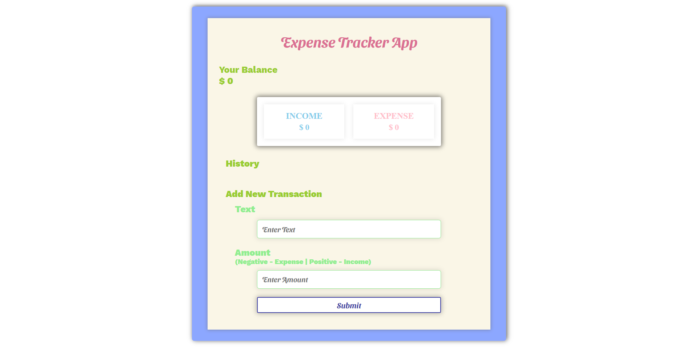

# Expense Tracker App.

#### Expense Tracker App is an expense-calculating app made using ReactJs and Styled Components.

---

### ⚒ Project Demo:

Experience the project in action by visiting our live demo: [Expense Tracker App](https://react-exp-app.surge.sh/)

---

### 📜 Case Study for "Expense Tracker App":

#### 🔗 Website URL: https://react-exp-app.surge.sh/
#### 😋 GitHub URL: https://github.com/faraasat/react-expense-tracker-app

#### 📚 Role: Software Developer

#### 💎 Client:
This project was done for self-learning purposes, as part of learning React. The "client" was essentially myself, aiming to build a functional expense tracker app.

#### 📌 Problem:
For this project, there was no specific problem to solve, as it was a learning exercise. However, the goal was to design and develop a functional expense tracker app using React, to demonstrate proficiency in the technology.

#### ⚡ Solution:
The solution was to design and develop a React-based expense tracker app, which allows users to add, edit, and delete expenses, as well as view total expenses. The app uses React Hooks for state management and functional components for a clean and modular code structure.

#### 🚀 Result:
The result is a fully functional expense tracker app, deployed on GitHub, which demonstrates a good understanding of React fundamentals, component-based architecture, and state management using React Hooks. The app is user-friendly, responsive, and easy to use, making it a great tool for personal expense tracking. Through this project, I gained hands-on experience with React and improved my skills in building scalable and maintainable web applications.

---

### ⚙ Dockerized Execution:

To run the project using Docker run the following commands:

For Development:

```bash
  docker build -f Dockerfile.dev -t <tag-name> .

  docker run -p 3000:3000 <tag-name>
```

For Production:

```bash
  docker build -f Dockerfile.prod -t <tag-name> .

  docker run -p 80:3000 <tag-name>
```

---

### 🤹‍♂️ Skills Utilized:

&nbsp;&nbsp;&nbsp;&nbsp;
&nbsp;&nbsp;&nbsp;&nbsp;
&nbsp;&nbsp;&nbsp;&nbsp;
&nbsp;&nbsp;&nbsp;&nbsp;
&nbsp;&nbsp;&nbsp;&nbsp;
&nbsp;&nbsp;&nbsp;&nbsp;

---

### ✔ Contributors:

We would like to acknowledge the following contributor for their valuable contributions to this project:

<p align="center">
  <a href="https://github.com/faraasat">
    
  </a>&nbsp&nbsp&nbsp&nbsp&nbsp&nbsp&nbsp&nbsp&nbsp&nbsp&nbsp&nbsp
</p>

---

### 📄 License

This project is licensed under the [MIT License](https://chat.openai.com/LICENSE), allowing you to use, modify, and distribute the code freely.

---

### 📷 Project UI:

Take a glimpse into the Project:

<p align="center">
  <a href="https://react-exp-app.surge.sh/">
    
  </a>
</p>
